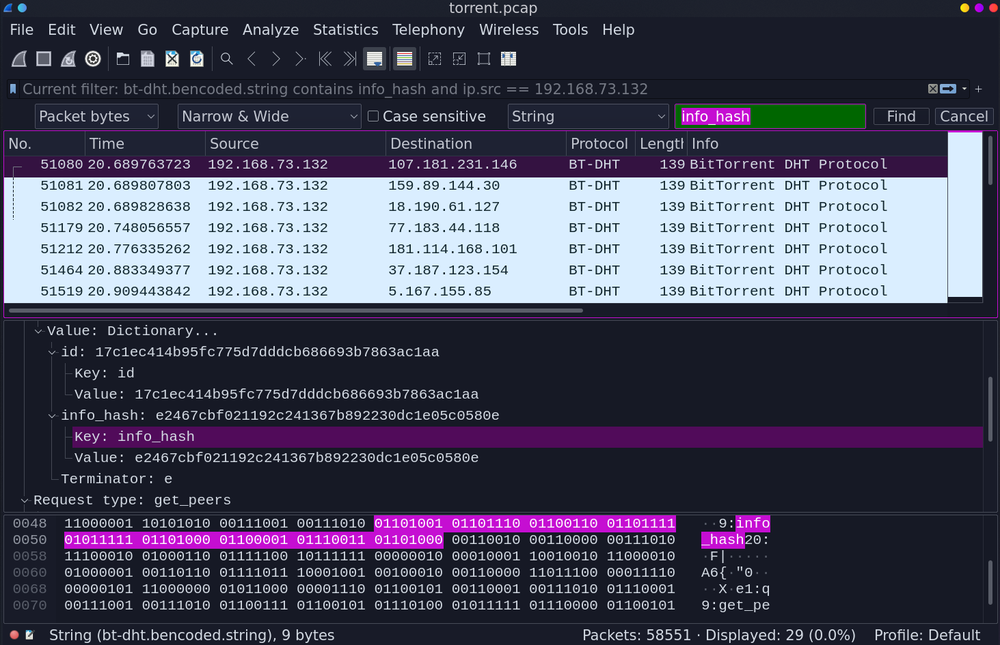
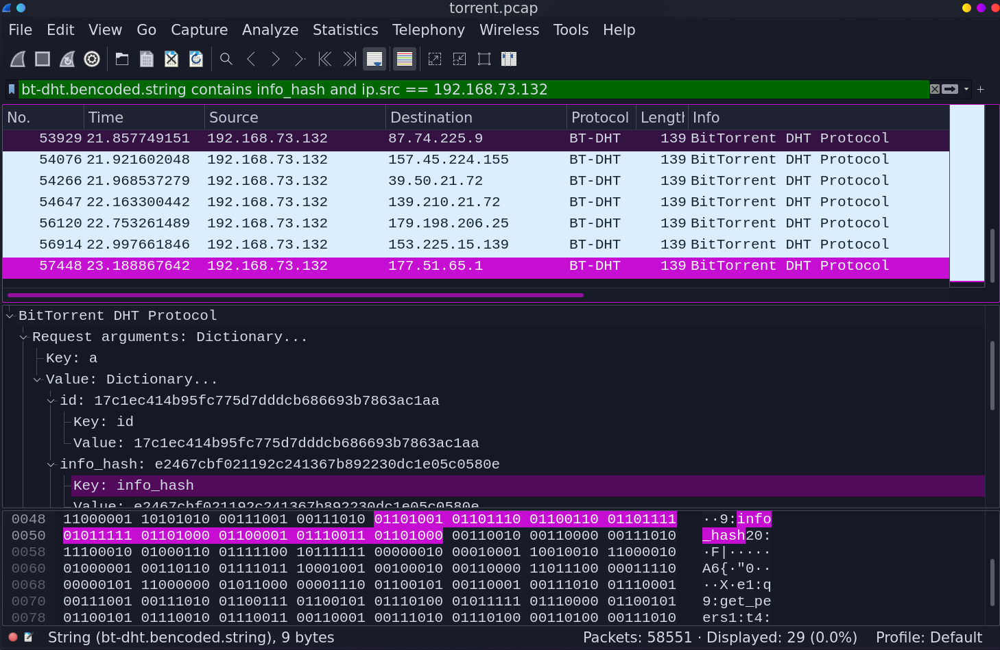

We will use Wireshark to analyze *torrent.pcap* file. To start this job, enable one protocol, that was disabled by default:

> **Analyze** -> **Enabled protocols** and select **BT-DHT** (Bittorrent DHT Protocol)

Now stop for a moment, read the challenge instruction carefully: we need to find **filename**, not file contents. That's really important, because you can spend hours there, trying to recover the file itself, but that's just waste of time in this case. Keep in mind also, that we are looking for a file, that has been **downloaded**, not shared, by someone in our network.

Another thing: we won't find the filename inside this *pcap* file. It will be a bit harder. Reading about torrents will sooner or later direct you to the term of *info_hash*, which is the SHA1 sum of the torrent file. Let's investigate that!

Just press Ctrl-F and type the term *info_hash* in the searching field. There are more than a few packets containing this term. Nice, but to be honest, there are too many of them. We have to filter it out more, because the value of *info_hash* differs between packets. BUT, do you remember, that we are looking for a file, that was downloaded? So let's only include packets where the source address is from our local network and info_hash string exists. This query will do:

> bt-dht.bencoded.string contains info_hash and ip.src == 192.168.73.132

Now *info_hash* in all filtered packets is the same: **e2467cbf021192c241367b892230dc1e05c0580e**. But that's a hash, not a filename, that we crave so much. What can we do now? Yeah, just google it:

Out job is done here, the flag is *picoCTF{ubuntu-19.10-desktop-amd64.iso}*